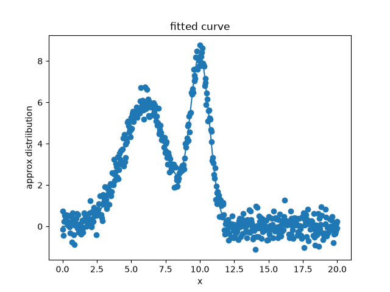

# Multi-Peak Gaussian Fitting for Spectral Data

Fits a sum of Gaussian peaks to a noisy 1D spectrum and checks the result against known ground truth. The script currently runs on simulated data, so fit accuracy and error can be measured directly.

This is a learning project in numerical methods and data analysis for spectroscopy. It is not validated on real instrument data yet.



## What it does

1. **Generates a synthetic spectrum**: a sum of Gaussians (known `mu`, `sigma`, `amp`) plus Gaussian noise.
2. **Estimates the noise level** from a baseline region at the edges of the x-range, where there should be no signal.
3. **Detects peaks** with `scipy.signal.find_peaks`, using height, prominence, and minimum-separation thresholds derived from the noise estimate.
4. **Builds initial guesses** from the detected peak positions and heights.
5. **Fits** all peaks simultaneously with `scipy.optimize.curve_fit`, with bounds keeping `sigma` and `amp` non-negative.
6. **Checks for hidden overlap**: if only one peak is detected, it fits both a 1-Gaussian and a 2-Gaussian model and keeps whichever has the lower AIC.
7. **Plots** the noisy data and the fitted curve.

## Model

Each peak is a Gaussian:

```
G(x) = amp * exp( -(x - mu)^2 / (2 * sigma^2) )
```

The fit parameter vector is flat, three values per peak:

```
[mu_1, sigma_1, amp_1, mu_2, sigma_2, amp_2, ...]
```

## Configuration

Set at the top of the script:

| Variable | Meaning |
|---|---|
| `true_curve` | Ground-truth parameters, `[mu, sigma, amp]` per peak |
| `noise` | Standard deviation of the added noise |
| `sigma_min` | Minimum peak width, used to set the minimum peak separation in `find_peaks` |
| `offset` | Starting separation for the two-peak model in the single-peak branch 
Peak-detection thresholds are computed from the baseline noise estimate: height at the baseline mean plus 4 standard deviations, prominence at 3.5 standard deviations.

## Limitations / Failures
- **Model selection is partial.** AIC comparison only runs when exactly one peak is detected. With two or more detected peaks, the count is taken as given.
- **No handling for zero detected peaks.** The script will fail if `find_peaks` returns nothing.
- **Unseeded noise.** Results change from run to run.
- **Gaussian lineshapes only**, with no baseline term in the fit. Real spectra generally need other lineshapes and baseline handling.
- **Parameter uncertainties are computed (`pcov`) but not yet reported or checked.**

## Roadmap

- [ ] add AIC comparison for n gaussians
- [ ] address the error caused by an empty `find_peaks`
- [ ] check error to ensure `curve_fit` accuracy with `true_curve` (not just eye test overlap with noise)
- [ ] calculate area of individual peaks
